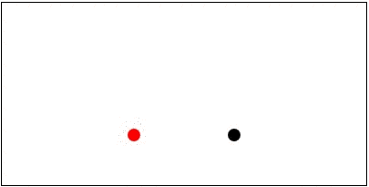
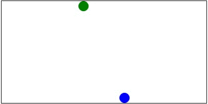

# CIA 3123 Mobile Game Development 

### CLO3 Animation


[TOC]

#### Introduction

Games need animation. 

Animation moves objects around the canvas. The object such as ball or some image appears to move from one place on the canvas to another.

This is possible as animation is mostly an illusion to the eye. What actually happens is the object is erased from the previous x, y coordinates and redraw at a new coordinate on the canvas. This happens so quickly that it appears the object is moving.


#### Animation using RequestAnimationFrame and setTimeout()

To control the speed at which is draw and erase the scene we will use *setTimeout()* and to using *requestAnimationFrame()*  tells the browser that you wish to perform an animation and requests that the browser calls a specified function to update an animation before the next scene is rendered on the canvas with the graphic object at a different x, y coordinates. 

##### Animation example 1 : Move a circle across the canvas

In the following example we draw a circle and move it across the canvas from left to right. Notice in the code example below how the circle is drawn in an anonymous function within *setTimeout()* with a delay of 20 milliseconds. If set want to slow the speed of the animation change the delay to a larger value.

Once the animation function is called once - it calls itself again through *requestAnimationFrame()* to better animate the graphic scene on the next repaint/render.

In the following code exam you can see that the circle starts at x = 0 on the left corner of the canvas and as the function is called repeatedly the x position is increased by 10.

Functions such as ***animate()*** that call themselves again and again are called *recursive functions*. 

```html
<canvas id="canvas1" width="400" height="200" style="border:1px solid #000000;">
 </canvas>
            
        <script>
            var canvas = document.getElementById("canvas1");
            var ctx = canvas.getContext("2d");
                
            //get the animation frame depending on the browser engine
            var requestAnimationFrame = window.requestAnimationFrame ||
                                        window.mozRequestAnimationFrame ||
                                        window.webkitRequestAnimationFrame ||
                                        window.msRequestAnimationFrame;

            //set intial start x and y coordinates
            var x = 0;
            var y = canvas.height / 2;
            
            var radius = 10;

            var delayBetweenFrames = 20; //the delay time is in milliseconds   

            //declare the animate() function
            function animate() {                
                //use the setTimeout to do the animation between frame using the 
                //delayBetweenFrames
                setTimeout(function() {

                    //animation code goes into this anonymous function handler
                    requestAnimationFrame(animate);

                    //clear the whole canvas area   
                    ctx.clearRect(0, 0, canvas.width, canvas.height);

                    //change the x postition
                    x = x + 10;

                    //draw a circle
                    ctx.beginPath();
                    ctx.arc(x, y, radius, 0, 2 * Math.PI);                
                    //fill the circle with green color
                    ctx.fillStyle = "#00FF00";
                    ctx.fill();

                    //if circle reaches the end of the canvas reset x = 0
                    if (x == canvas.width) {
                        x = 0;
                    }

                }, delayBetweenFrames);
            }

            //call the animate() function
            animate();
        </script>

```

##### Clearing the canvas for the next frame

Observe in the above example how the canvas is cleared for the next repaint of the animation scene by using *ctx.clearRect()* which is used to clear a rectangular part of the canvas. In the above example we are clearing the canvas from (0.0) the top left to *canvas.width* and *canvas.height* which is bottom right. 

```js
//clear the whole canvas area   
ctx.clearRect(0, 0, canvas.width, canvas.height);
```

This clears the whole canvas and erases any objects drawn on it.

##### Making the animation repeatable

To make the animation repeatable we have used a condition to check of the x of our circle would become 0 at some point as x is continuously increasing, when it reaches the end of the canvas i.e, when the circle         *x == canvas.width* we set the x to zero so that animation restarts from left of canvas again.


```js
//if circle reaches the end of the canvas reset x to 0
if (x == canvas.width) {
 	x = 0;
}
```

##### Animation example 2: moving an image

Animating an image uses the same technique as animating a shape as shown in the above example of moving circle. The idea is to draw the image at different positions and erase the previous frame so it appears that the image is moving.  As in the above example this is done using the *setTimeout()* and *requestAnimationFrame()*, and using recursion to repeat the animation continuously while changing the x or y or both coordinates as needed by the animation.

In the following example the image is moved horizontally from left to right so that x is increasing and when it is moving back x is decreasing. 

The direction of the image is controlled by a <u>boolean variable</u> *goRight*. If *goRight* is true the we increase the *imageX* when *goRight* is false we decrease the  imageX. *goRight* is changed when the image reaches and rightmost or leftmost ends of the canvas to allow the animation to be continuous.

```html
<canvas id="canvas1" width="500" height="200" style="border:1px solid #000000;">
</canvas>
            
<script>
	const canvas = document.getElementById("canvas1");
    const ctx = canvas.getContext("2d");
                
	var dukeImage = new Image();
	dukeImage.src = 'duke0.png';
				
	var goRight = true;
				
    var imageX = 0;
    var imageY = 50;
				
	let width = 30;
	let height = 30;
				
    const requestAnimationFrame = window.requestAnimationFrame ||
                                  window.mozRequestAnimationFrame ||
                                  window.webkitRequestAnimationFrame ||
                                  window.msRequestAnimationFrame;
                
    const framesPerSecond = 20;
                
    function moveDuke() {

         setTimeout(function() { //anonymous function inside setTimeout()
         	requestAnimationFrame(moveDuke);
                         
			//clear the canvas erasing the image drawing in the previous frame
            ctx.clearRect(0, 0, canvas.width, canvas.height);
						   
			// change the imageX as per the direction (right/left)
            if(goRight)
				imageX = imageX + 5;
            else
                imageX = imageX - 5;
	
            //draw the image again
			ctx.drawImage(dukeImage, imageX, imageY, width, height);

            //if image reaches the right end of the canvas change direction
            if (imageX == canvas.width) 
            	goRight = false;
             
            //if image reaches 0 when coming back restart             
            if (imageX == 0 && !goRight)
                goRight = true;
                           
         }, 1000 / framesPerSecond); //end setTimeout                                     
  }
            
  moveDuke();
</script>
```

The resulting animation


### Exercises

<u>**Exercise 1:**</u> Create a new file and write the JavaScript code to move two balls as shown below. The red ball starts from bottom center to and move to top and it falls back again to bottom center. The black ball starts from bottom center and moves to top right and falls back again to bottom center. Make sure the animation is continuous.



**<u>Exercise 2</u>**: Create a new file and write the code to move the two balls as shown below. The balls have to move in opposite directions. Make sure that the animation is continuous.




**<u>Exercise 3</u>**: Create a new file and write the JavaScript code to move the two balls as shown in the animation below. The green ball moves horizontally and the orange ball moves vertically down. Make the balls go back when the reach the edges of the canvas so that a bouncing effect can be seen. Make the animation continuous.


### Code examples

[Ball vertical drop animation](./CircleAnimationVertDrop.html)

[Ball vertical drop continuous animation](./CircleAnimationVertDropContinuous.html)

[Circle and Rectangle animation](./CircleRectangleAnimationOpposite.html)

[Circle diagonal animation](./CircleAnimation-DiagonalUsingFunction.html)